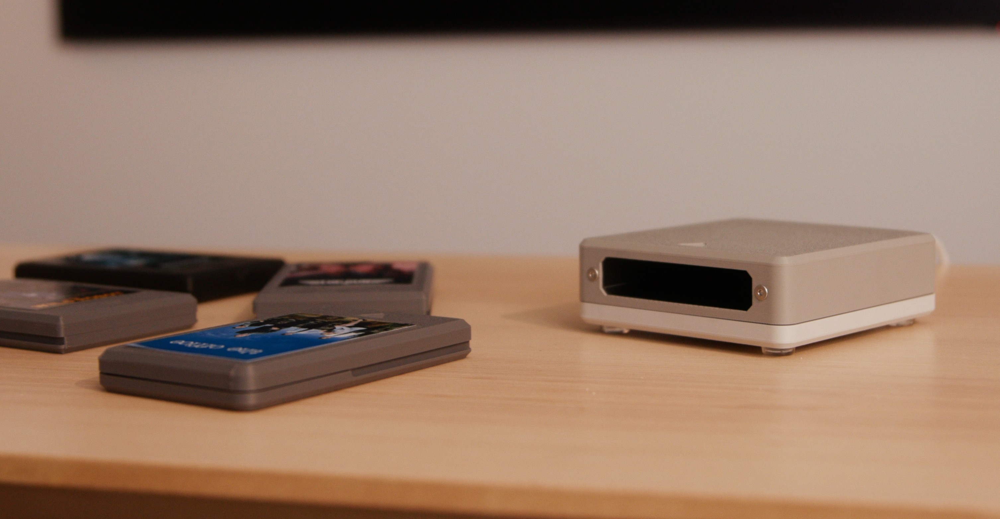

# 🎞️ NFC Cartridge Media Player

Bring back the magic of movie night — without the rewinding.

This ESPHome-powered cartridge player uses NFC tags and Home Assistant to recreate the nostalgia of physical media. Insert a cartridge, and your smart home takes care of the rest: turning on the TV, playing a movie, dimming the lights — whatever you like.

Whether you're a fan of VHS-era rituals or just want a fun new way to launch automations, this project combines retro vibes with modern convenience.

---

## 🔗 Quick Links

- 🔽 **[Latest Release](https://github.com/TheStockPot/NFC-Cartridge-Player/releases/latest)**  
- 📖 **[Blog Post](https://www.thestockpot.net/videos/cartrdgeplayer)**  
- 📦 **[Bill of Materials](https://github.com/TheStockPot/NFC-Cartridge-Player/blob/TheStockPot-VideoRelease/BOM.md)**  
- 🖨️ **[3D Print Files](https://www.printables.com/model/1337649-esphome-cartridge-player)**  
- 🧠 **[ESPHome Config](https://github.com/TheStockPot/NFC-Cartridge-Player/blob/TheStockPot-VideoRelease/esphome/cartridge_player.yaml)**  
- 📺 **[Project Video](https://www.youtube.com/@TheStockPot-AU)**  
- 🛠️ **[Assembly & Automation Tutorial](https://www.youtube.com/@TheSaucepan-AU)**

---

## 🧰 What It Does

- Reads NFC tags inside custom 3D-printed cartridges  
- Sends tag ID to Home Assistant via ESPHome  
- Triggers automations like:
  - Playing a specific movie or playlist (e.g. via Plex or YouTube)
  - Turning on devices or scenes
  - Running scripts (e.g. dimming lights, launching consoles)

---

## 🛠️ Build Your Own

All components are simple and affordable, with a [Bill of Materials available here](https://github.com/TheStockPot/NFC-Cartridge-Player/blob/TheStockPot-VideoRelease/BOM.md), and a full kit available at [thestockpot.net](https://www.thestockpot.net).

🛠️ **Assembly & programming tutorial:**  
[▶️ Watch the tutorial video](https://www.youtube.com/@TheSaucepan-AU)

---

## 🧑‍💻 How It Works

1. Insert a cartridge  
2. ESP32 detects the NFC tag via the RC522  
3. ESPHome reports the tag ID to Home Assistant  
4. Home Assistant runs an automation based on the cartridge ID  
5. Cartridge removed? Media stops. Magic.
